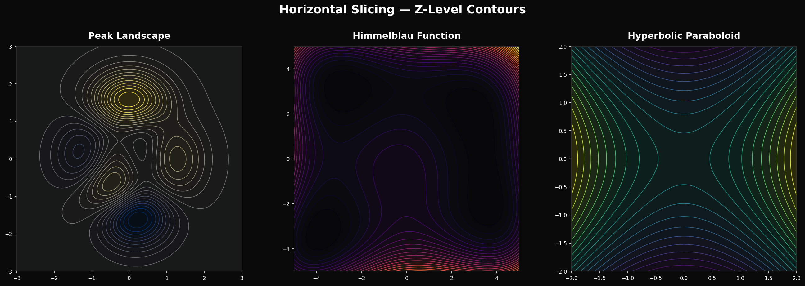
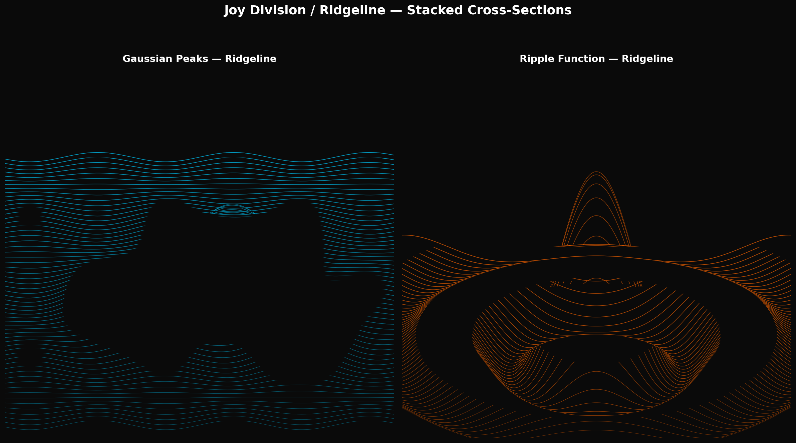
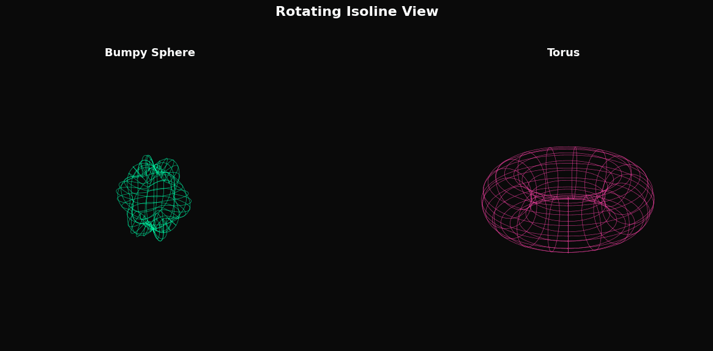
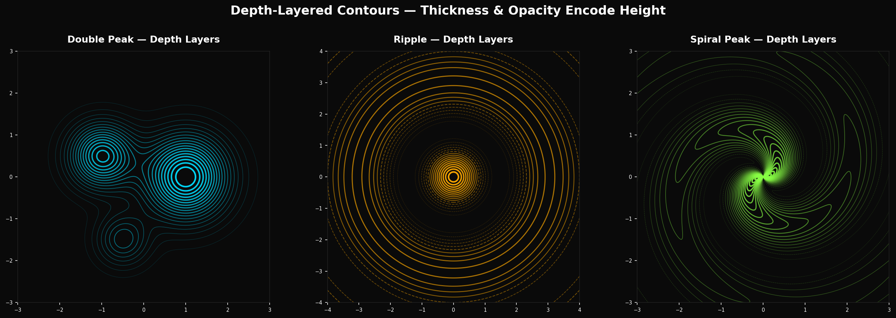
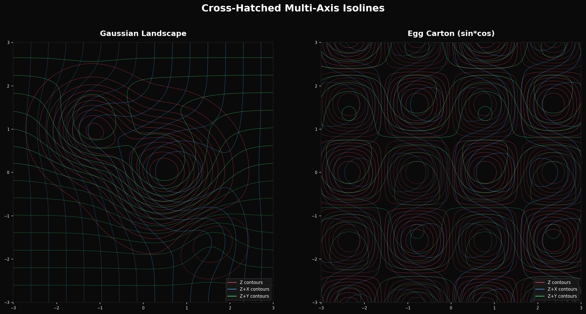
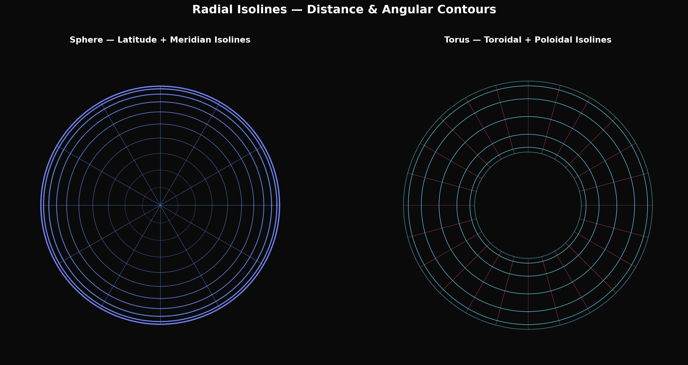
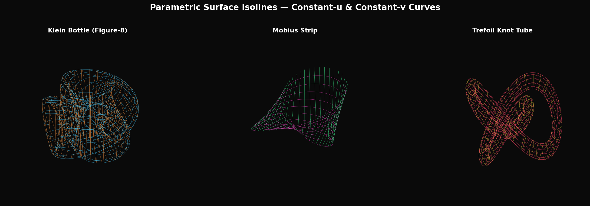
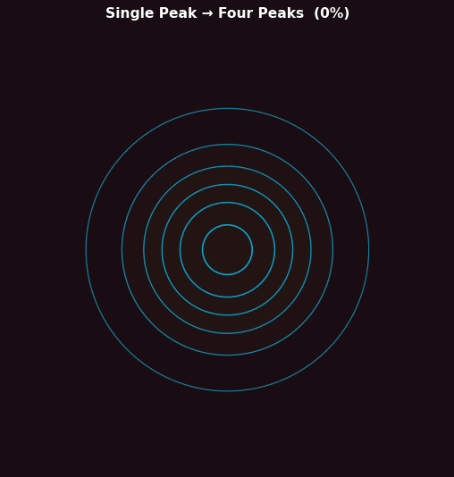

# Isoline 3D Visualization

An exploration of eight distinct approaches to visualizing three-dimensional objects using only isolines (contour lines). Each technique reveals different aspects of 3D shape through pure line work — no filled surfaces, shading, or lighting.

## Approaches

### 1. Horizontal Slicing — Z-Level Contours

The classic topographic map approach. The 3D surface is sliced at regular z-levels, and each slice boundary is projected onto the xy-plane. Line density encodes slope steepness — closely spaced contours indicate steep terrain.

**Surfaces shown:** Peak Landscape (MATLAB peaks function), Himmelblau Function, Hyperbolic Paraboloid (saddle).

**Strengths:** Intuitive, widely understood, precise height reading. **Weaknesses:** No sense of 3D orientation; requires mental reconstruction.

---

### 2. Joy Division / Ridgeline — Stacked Cross-Sections

Cross-section profiles taken along one axis and stacked vertically with occlusion. Back-to-front rendering with background-colored fills creates the illusion of depth. Inspired by the iconic *Unknown Pleasures* album cover.

**Surfaces shown:** Gaussian peaks terrain, radial ripple function.

**Strengths:** Immediate 3D perception, dramatic visual impact, natural occlusion. **Weaknesses:** Only shows one viewing direction; back features hidden.

---

### 3. Rotating Isoline Animation

Iso-parameter curves (constant-u and constant-v lines) drawn on 3D surfaces and viewed from a continuously rotating camera. The rotation resolves depth ambiguity that static isoline views have.

**Surfaces shown:** Bumpy sphere (radius modulated by spherical harmonics), torus.

**Strengths:** Full 3D comprehension through motion parallax. **Weaknesses:** Requires animation; not suitable for print.

---

### 4. Depth-Layered Contours — Thickness & Opacity Encode Height

Standard horizontal contours, but line thickness and opacity are modulated by z-level. Higher contours appear thicker and brighter (closer to viewer), lower contours are thin and faint (further away). This creates a sense of depth without any 3D projection.

**Surfaces shown:** Double peak, concentric ripple, spiral peak.

**Strengths:** Encodes depth in a flat 2D view, no 3D projection needed. **Weaknesses:** Can be ambiguous — thick lines could be misread as "more important" rather than "closer".

---

### 5. Cross-Hatched Multi-Axis Isolines

Three sets of contour lines are overlaid, each computed from a different linear combination of the coordinates: pure Z contours, Z+X contours (tilted in x), and Z+Y contours (tilted in y). The resulting cross-hatch pattern has varying density that encodes surface curvature.

**Surfaces shown:** Gaussian landscape, egg carton function (sin*cos).

**Strengths:** Reveals curvature and slope direction simultaneously; resembles engraving techniques. **Weaknesses:** Visual complexity; harder to read specific values.

---

### 6. Radial Isolines — Distance & Angular Contours

For objects with rotational symmetry, isolines follow the natural coordinate system of the shape: latitude lines (constant polar angle) and meridians (constant azimuthal angle) for a sphere; toroidal and poloidal circles for a torus.

**Surfaces shown:** Sphere (latitude + meridian lines), torus (toroidal + poloidal circles).

**Strengths:** Perfectly reveals the topology of rotationally symmetric objects. **Weaknesses:** Only works well for shapes with obvious natural coordinates.

---

### 7. Parametric Surface Isolines — Constant-u & Constant-v Curves

For surfaces defined parametrically as (x(u,v), y(u,v), z(u,v)), the natural isolines are curves of constant u and constant v. These form a coordinate grid that conforms to the surface geometry, making topology immediately visible.

**Surfaces shown:** Figure-8 Klein bottle, Mobius strip, trefoil knot tube.

**Strengths:** Reveals topology and self-intersection naturally; works for non-orientable surfaces. **Weaknesses:** Requires a parametric definition; line density is not uniform if parameterization is non-uniform.

---

### 8. Animated Morphing Contours

Smooth interpolation between different 3D surfaces, showing how their contour maps transform over time. Reveals how topology changes (contour lines split, merge, appear, and disappear) as the underlying shape morphs.

**Transitions:** Single peak → four peaks → ring peak → saddle → single peak.

**Strengths:** Shows topological transitions in real time; compelling as a visualization of deformation. **Weaknesses:** Temporal — requires animation to convey the full story.

---

## Comparison

| Approach | Depth Cue | Static/Animated | Best For |
|---|---|---|---|
| Horizontal slicing | Line density | Static | Height fields, terrain |
| Joy Division | Occlusion | Static | Dramatic presentation |
| Rotating isolines | Motion parallax | Animated | Complex 3D shapes |
| Depth-layered | Thickness/opacity | Static | Emphasizing peaks |
| Cross-hatched | Line density pattern | Static | Curvature visualization |
| Radial isolines | Coordinate grid | Static | Symmetric objects |
| Parametric isolines | Surface grid | Static | Topological surfaces |
| Morphing contours | Temporal change | Animated | Shape deformation |

## Key Findings

- **Occlusion is the strongest depth cue** in static isoline rendering. The Joy Division approach creates immediate 3D perception with minimal information, precisely because hidden lines are removed.
- **Line density naturally encodes surface gradient** — wherever isolines crowd together, the surface is steep. This is an inherent property of contour maps and requires no additional encoding.
- **Cross-hatching multiple contour sets** mimics classical engraving techniques and reveals curvature direction, something single-axis contours cannot show.
- **Depth-modulated line weight** is a simple but effective trick: thicker/brighter lines read as closer, adding a sense of relief to a flat contour map without any projection.
- **Parametric iso-curves are the only approach that works for non-orientable surfaces** (Klein bottle, Mobius strip) since there is no consistent "height" to slice.
- **Animation resolves all depth ambiguity** — even a simple rotation makes any isoline representation immediately legible as 3D. The trade-off is that the result is no longer a single static image.

## Tools Used

- Python 3 with NumPy, matplotlib, and Pillow
- matplotlib `contour`/`contourf` for horizontal slicing and derived techniques
- matplotlib 3D projection for parametric surfaces and rotation animation
- Pillow for GIF assembly
