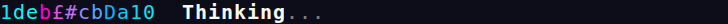
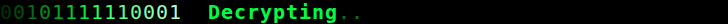
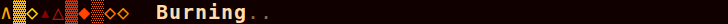
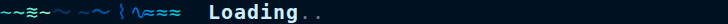
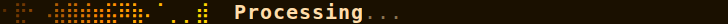
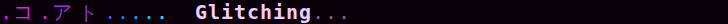
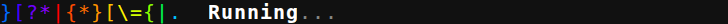
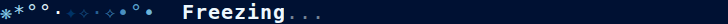

# Spinner Design Variations

An exploration of animated terminal spinner designs inspired by [crush CLI](https://github.com/charmbracelet/crush)'s gradient spinner. 8 variations with distinct character sets, color palettes, and animation feels — all recorded with VHS.

---

## How Crush's Spinner Works

Crush's spinner (`internal/ui/anim/anim.go`) uses:

1. **Random character selection** from `"0123456789abcdefABCDEF~!@#$£€%^&*()+=_"`
2. **HCL gradient blending** via `go-colorful` (`c1.BlendHcl(c2, t)`) for perceptually smooth color transitions
3. **Pre-rendered frames** — static (10 frames) or cycling (`width * 2` frames) to avoid per-render color math
4. **Staggered birth offsets** — each character position gets a random delay (up to 1s) before it "appears", creating a cascading entrance
5. **20 FPS** Bubble Tea tick loop; cycling mode shifts the gradient offset each frame for a "flowing" effect

---

## Variations

### 1. Crush Classic
A faithful recreation of crush's spinner with the same character set and HCL gradient blending.

- **Characters:** `0123456789abcdefABCDEF~!@#$£€%^&*()+=_`
- **Gradient:** Magenta `#FF00CC` → Cyan `#00FFFF`
- **Colors cycle:** Yes — gradient flows left-to-right across frames
- **FPS:** 20 | **Width:** 12



[spinner1.gif](output/spinner1.gif)

---

### 2. Matrix Rain
Binary cascade with a dark green-on-black terminal feel. Uses primarily `0`/`1` digits for a classic cyberpunk readout look.

- **Characters:** `01001101010110100110100110101100111001010`
- **Gradient:** Dark green `#003300` → Bright green `#00FF41` → Pale mint `#AAFFCC`
- **Colors cycle:** No — static gradient, emphasis on fast character flicker
- **FPS:** 25 | **Width:** 14



[spinner2.gif](output/spinner2.gif)

---

### 3. Fire
Warm flame shapes using block/triangle Unicode. The dark-red background theme reinforces heat.

- **Characters:** `▲△◆◇░▒▓▴▵∧`
- **Gradient:** Dark red `#8B0000` → Orange-red `#FF4500` → Orange `#FF8C00` → Gold `#FFD700`
- **Colors cycle:** Yes — flame "rises" through the gradient
- **FPS:** 15 | **Width:** 10



[spinner3.gif](output/spinner3.gif)

---

### 4. Ocean Wave
Smooth water motion characters blending through a deep-sea-to-aquamarine palette.

- **Characters:** `≋~≈∿⌇〜∼`
- **Gradient:** Navy `#003366` → Ocean blue `#0066CC` → Teal `#00CED1` → Aquamarine `#7FFFD4`
- **Colors cycle:** Yes — wave rolls through positions
- **FPS:** 18 | **Width:** 12



[spinner4.gif](output/spinner4.gif)

---

### 5. Retro Braille
Dense braille dot patterns in a warm amber monochrome. Wide (16 chars) for a data-dense terminal feel.

- **Characters:** `⣾⣽⣻⢿⡿⣟⣯⣷⠿⣀⣤⣶⣿⡀⠁⠂⠄⠸⠰⠠`
- **Gradient:** Dark brown `#5C2E00` → Amber `#FF8C00` → Gold `#FFD700`
- **Colors cycle:** No — static warm-amber gradient across positions
- **FPS:** 20 | **Width:** 16



[spinner5.gif](output/spinner5.gif)

---

### 6. Neon Glitch
Full-width Katakana characters cycling through an electric pink→purple→cyan palette. The widest character set creates a chaotic digital glitch feel.

- **Characters:** `アイウエオカキクケコサシスセソタチツテトナニヌネノ`
- **Gradient:** Hot pink `#FF00FF` → Purple `#7B2FBE` → Electric cyan `#00F0FF`
- **Colors cycle:** Yes — fast neon sweep
- **FPS:** 22 | **Width:** 10



[spinner6.gif](output/spinner6.gif)

---

### 7. Rainbow Minimal
Familiar ASCII punctuation chars cycling through a full ROYGBIV rainbow. Simple characters keep focus on the color sweep.

- **Characters:** `.+*!|/-\:;=?><[]{}()`
- **Gradient:** Red → Orange → Yellow → Green → Blue → Violet (6 stops)
- **Colors cycle:** Yes — full spectrum rolls through
- **FPS:** 20 | **Width:** 14



[spinner7.gif](output/spinner7.gif)

---

### 8. Snow / Ice
Snowflake Unicode characters on a dark-navy background, fading from deep blue to white. Slow FPS gives a drifting, calm feel.

- **Characters:** `❄✦✧✶❋*·°•`
- **Gradient:** Deep blue `#003366` → Steel blue `#4488BB` → Sky blue `#87CEEB` → White `#FFFFFF`
- **Colors cycle:** Yes — frost crystallizes left-to-right
- **FPS:** 16 | **Width:** 12



[spinner8.gif](output/spinner8.gif)

---

## Design Space Observations

### Character Set Choices Matter More Than Expected
- **Dense chars** (braille, katakana) feel "heavier" and data-rich even at the same FPS
- **Geometric shapes** (▲◆░) read as iconographic rather than textual — warmer, more decorative
- **Wave/water chars** (≋~≈) have inherent directionality that amplifies the flowing gradient
- **Sparse ASCII** (`.+*!`) let color carry the full visual weight — best for showcasing a gradient

### Color Space: HCL vs RGB
Blending in HCL (Hue/Chroma/Luminance) avoids the muddy gray middle that occurs with RGB interpolation, especially across hue boundaries (e.g., red → green). The ocean wave gradient is a clear example where RGB would produce a washed-out teal midpoint vs. the vibrant transition visible here.

### FPS vs Character Change Rate
These spinners use the same FPS for both color cycling and character randomization. Decoupling these (as crush does with separate frame counts) would allow:
- Slow color drift + fast char flicker (hypnotic)
- Fast color flash + slow char change (stroby)

### Birth Delay Effect
The staggered birth offset (`BirthDelay`) has large impact on perceived "personality":
- Long delays (0.8–1.0s): Characters materialize slowly, feels deliberate and organic
- Short delays (0.3–0.4s): Nearly simultaneous appearance, feels immediate and snappy
- The braille and snow variations use the longest delays, which fits their "quiet accumulation" theme

### Theming the Terminal
VHS's theme JSON allows matching the terminal background to the spinner's palette — this is surprisingly important. The fire spinner on a dark-red background looks more cohesive than it would on a generic black terminal.

---

## Implementation

All 8 variations share a single engine in `main.go`:

```go
type SpinnerConfig struct {
    Chars       []rune         // character pool
    ColorStops  []colorful.Color  // gradient waypoints (HCL-blended)
    Width       int            // number of animated character positions
    FPS         int            // frames per second
    CycleColors bool           // shift gradient offset per frame
    BirthDelay  float64        // max stagger delay in seconds
}
```

Frames are pre-rendered: `preRender()` computes all `(totalFrames × width)` colored strings upfront. The main loop only writes pre-built strings to stdout, keeping the hot path allocation-free.

---

## Files

| File | Description |
|------|-------------|
| `main.go` | All 8 spinner configs + shared animation engine |
| `go.mod` / `go.sum` | Go module (uses `go-colorful` for HCL gradients) |
| `tapes/N_name.tape` | VHS tape file for each spinner |
| `output/spinnerN.gif` | Animated GIF recording |
| `output/spinnerN_preview.png` | Static preview frame (frame 40 of recording) |

---

## Tools

- **Go 1.24** with [`go-colorful`](https://github.com/lucasb-eyer/go-colorful) for HCL color blending
- **VHS v0.9.0** for terminal recording → GIF + PNG frames
- **Playwright Chromium 141** (headless) as VHS's browser renderer
- **ffmpeg 6.1.1** for GIF encoding
