# Visualize Queue Flow

Terminal visualizations of two applications communicating over a RabbitMQ-style queue,
built with [Bubble Tea](https://github.com/charmbracelet/bubbletea) and
[Lip Gloss](https://github.com/charmbracelet/lipgloss).

The scenario: `node-a` (publisher) sends messages to a queue; `node-b` (consumer) reads
from it. Pub and consume rates oscillate on different sinusoidal cycles, so the queue
naturally fills and drains. 22 visualizations explore this from a single colored bar to
a full multi-panel dashboard.

## Running

```
go build -o mqvis .
./mqvis -mode <mode>
```

| Flag | Description |
|------|-------------|
| `queue-l1` `queue-l2` `queue-l3` | Queue depth gauge |
| `flow-l1` `flow-l2` `flow-l3` | Message flow animation |
| `status-l1` `status-l2` `status-l3` | Publisher / Consumer status panels |
| `throughput-l1` `throughput-l2` `throughput-l3` | Throughput graphs |
| `timeline-l1` `timeline-l2` `timeline-l3` | Event timeline |
| `topology-l1` `topology-l2` `topology-l3` | Network topology |
| `latency-l1` `latency-l2` `latency-l3` | Latency distribution |
| `dashboard` | Full multi-panel dashboard |

Each program auto-quits after 8–12 seconds (configurable via `maxTicks`).

---

## Area 1 · Queue Depth Meter

The queue as a fill gauge. Color shifts green → yellow → red as depth approaches capacity.

| Level | Description |
|-------|-------------|
| L1 | Single progress bar with fill %, totals, and FILLING/DRAINING/STABLE status |
| L2 | Animated gauge with pub/con rate labels on each side; color border pulses |
| L3 | Gauge + sparkline history + dual rate history traces |

**queue-l1**
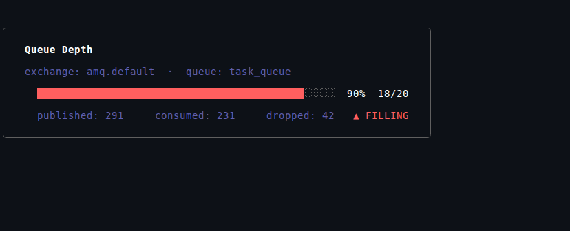

**queue-l2**
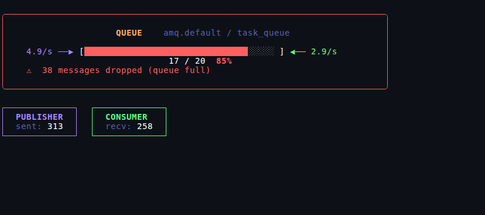

**queue-l3**
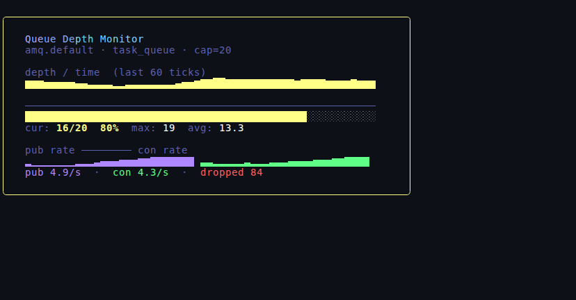

---

## Area 2 · Message Flow Animation

Messages as particles traveling left (publisher) → centre (queue zone) → right (consumer).

| Level | Description |
|-------|-------------|
| L1 | Static topology diagram: node boxes + connecting arrows, queue fill bar |
| L2 | Single animated row — dots travel along a pipe, queue zone fills/empties visually |
| L3 | 5-row particle stream; publisher bursts, queue stacking, consumer absorption effects |

**flow-l1**
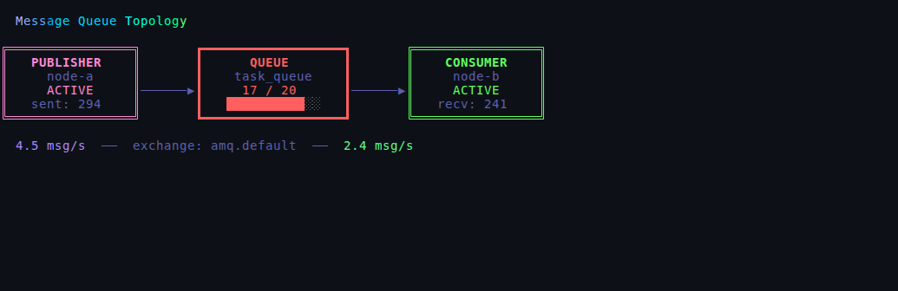

**flow-l2**
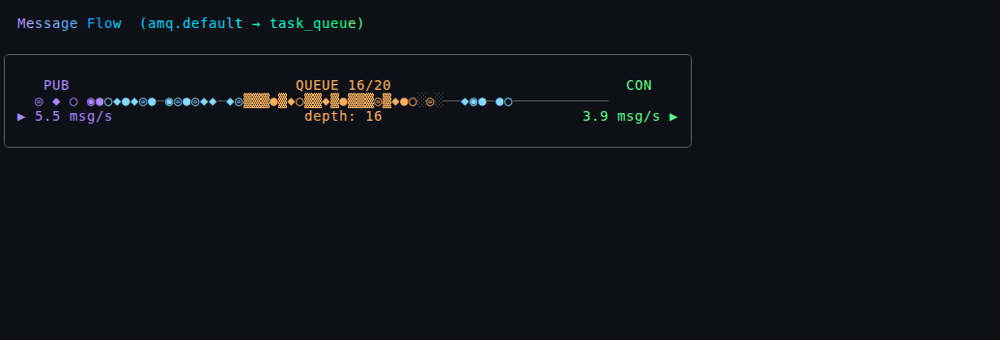

**flow-l3**
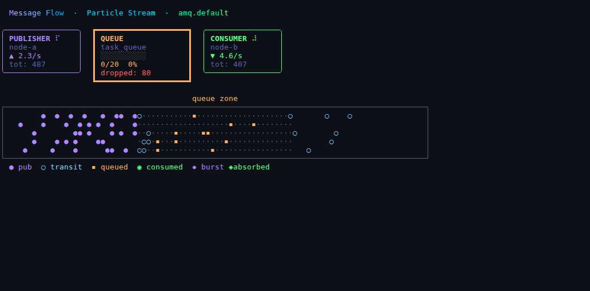

---

## Area 3 · Publisher / Consumer Status Panels

What each app is doing: connection details, rate, message count, recent activity.

| Level | Description |
|-------|-------------|
| L1 | Two bordered boxes — name, IDLE/PUBLISHING/CONSUMING state, counters |
| L2 | Animated spinners, live rate bars (`▰▰▰▱▱`), color border activates on traffic |
| L3 | Full panels with AMQP details, recent message list, avg latency, sparklines |

**status-l1**
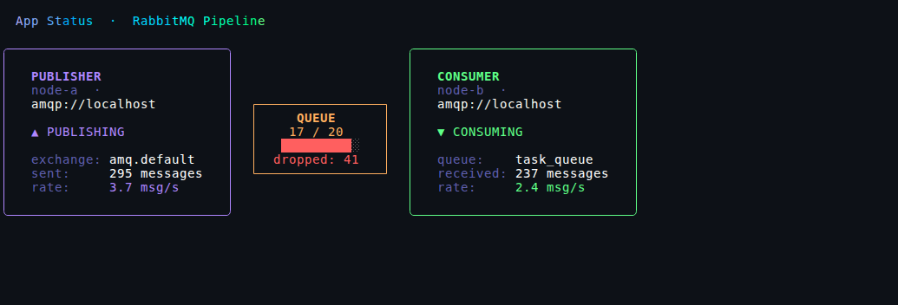

**status-l2**
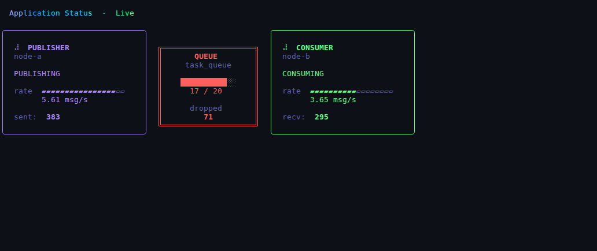

**status-l3**
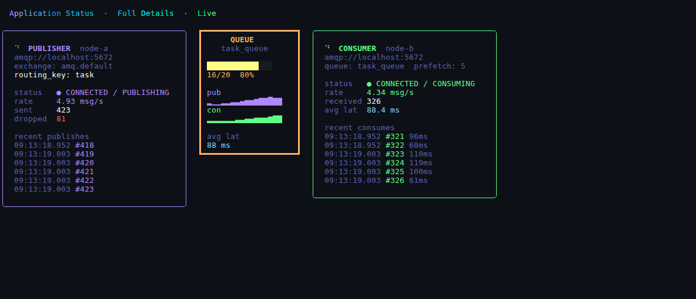

---

## Area 4 · Throughput Graph

Publish and consume rates over time. The phase difference between their sinusoids naturally
creates filling and draining episodes.

| Level | Description |
|-------|-------------|
| L1 | Scrolling publish-only bar chart, 8 rows high |
| L2 | Mirrored dual chart — publish bars grow up, consume bars grow down |
| L3 | Interleaved dual vertical bars (pub=purple, con=green) + queue depth sparkline |

**throughput-l1**
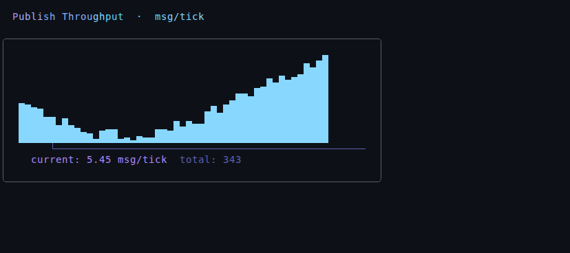

**throughput-l2**
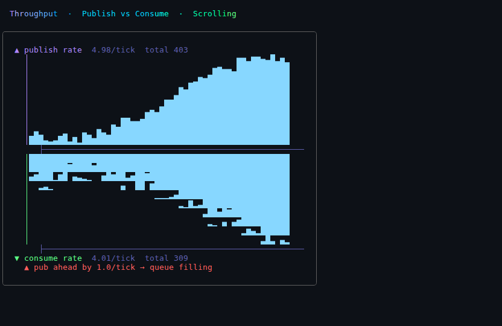

**throughput-l3**
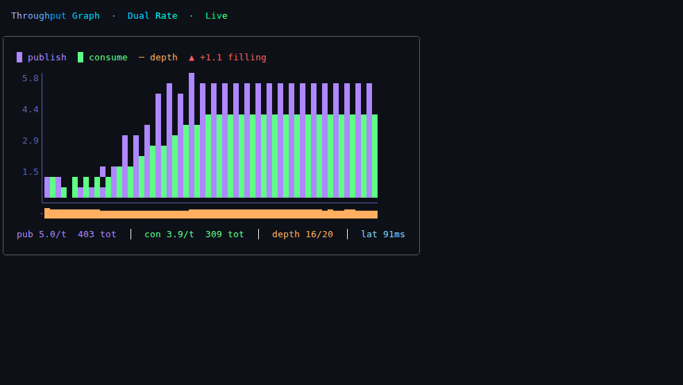

---

## Area 5 · Event Timeline

Lifecycle events for individual messages: PUBLISHED → QUEUED → CONSUMED / DROPPED.

| Level | Description |
|-------|-------------|
| L1 | Static colored list of last 16 events with timestamps |
| L2 | Streaming feed; age indicator (`▐` → `▌` → `·`) fades older entries |
| L3 | Four-column layout (PUB / QUE / CON / DRP) with cumulative counts and rate bars |

**timeline-l1**
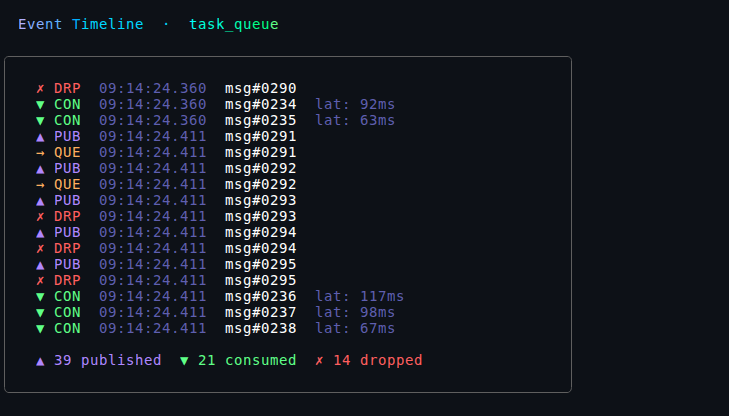

**timeline-l2**
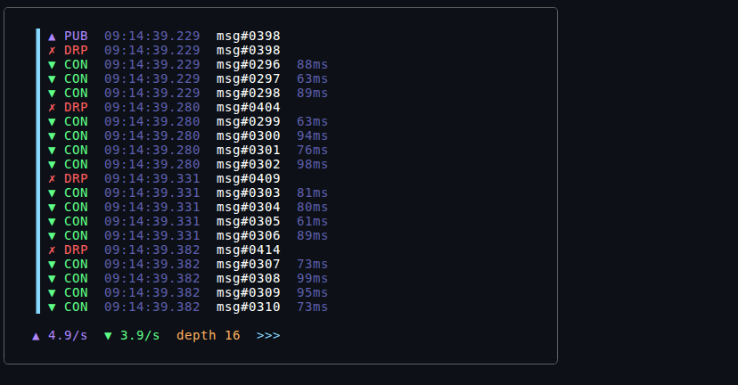

**timeline-l3**
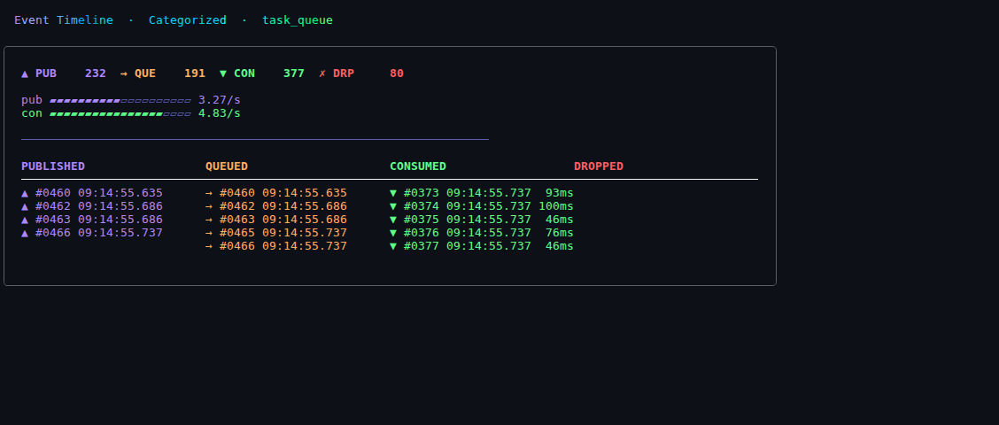

---

## Area 6 · Network Topology

The pipeline as a graph: two nodes connected by an edge (the queue).

| Level | Description |
|-------|-------------|
| L1 | Clean ASCII node diagram with double borders; edge arrows; rate labels |
| L2 | Animated dot particles travel along each AMQP edge (publish and consume) |
| L3 | Full graph: per-node sparklines, depth sparkline in queue box, rate pressure indicator |

**topology-l1**
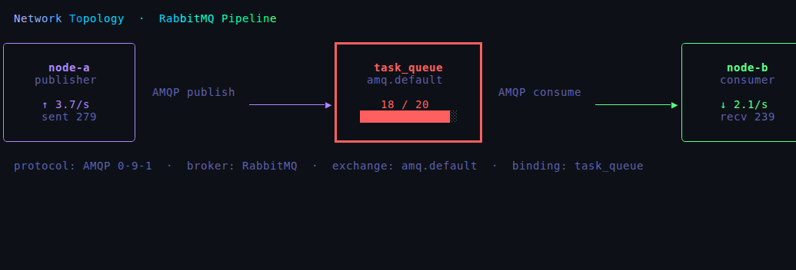

**topology-l2**
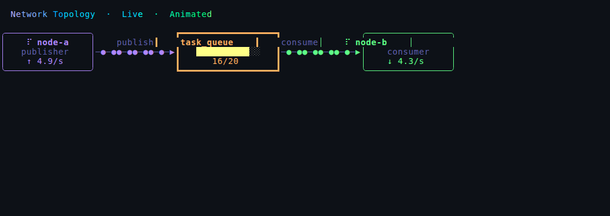

**topology-l3**
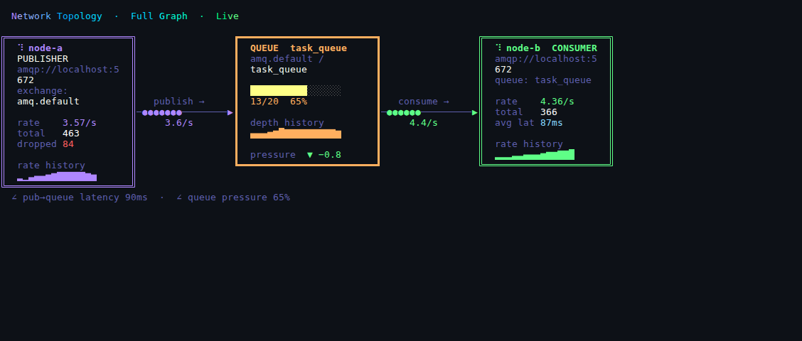

---

## Area 7 · Latency Distribution

How long messages wait in the queue before being consumed (proportional to queue depth).

| Level | Description |
|-------|-------------|
| L1 | Horizontal histogram bars: 8 latency buckets 0–20ms … 150ms+, color-coded |
| L2 | Live-updating histogram with rolling 40-sample window + latency trend sparkline |
| L3 | **2D heat grid** — rows = latency bucket, columns = time slot, color = count intensity |

**latency-l1**
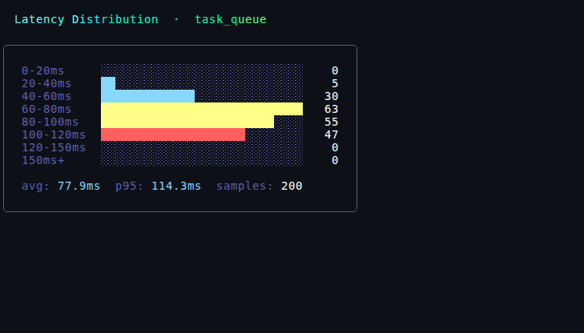

**latency-l2**
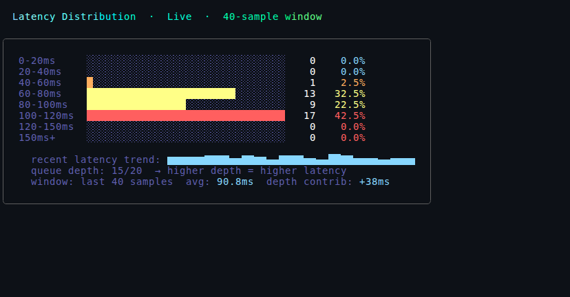

**latency-l3**
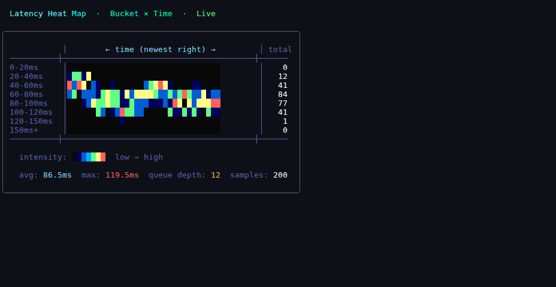

---

## Area 8 · Full Dashboard

All concepts in one screen (requires ~120-column terminal).

- **Top**: full-width queue depth gauge with sparkline history
- **Middle**: full-width particle flow animation
- **Bottom left**: publisher + consumer status with rate bars
- **Bottom centre**: interleaved dual throughput chart
- **Bottom right**: live event feed

**dashboard**
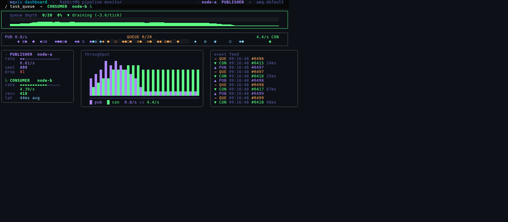

---

## Key Findings

### Visualization design

**Queue depth is the anchor metric.** Every other visualization makes more sense when you
can see the queue fill level. The color ramp (green → yellow → red) communicates urgency
faster than any number.

**Particle flow is the most intuitive.** Seeing dots slow down and pile up in the queue
zone — and then accelerate toward the consumer when the queue drains — makes the async
buffer concept immediately tangible. Even L1 (static boxes with arrows) conveys the
topology at a glance.

**Heat grids reveal temporal patterns invisible in snapshot views.** The latency heat
map (`latency-l3`) shows the *history* of the distribution, making it obvious when queue
pressure shifts latency upward. A single histogram (L1) shows the current state but hides
the trend.

**The mirrored throughput chart (throughput-l2)** is the most dramatic single visualization
for showing rate imbalance — the asymmetry is visually immediate when pub bars go up while
con bars don't keep pace.

### Technical

**Sinusoidal rates with different periods create natural dynamics.** Choosing
`pub = 3.0 + 2.5·sin(0.07t)` and `con = 2.8 + 1.8·sin(0.05t+1.2)` means the rates
drift in and out of phase, causing organic filling/draining cycles across the recording
duration. No manual scripting of state changes needed.

**Pillow-based GIF assembly works as a drop-in VHS ffmpeg replacement.** VHS's PNG output
mode (`Output foo.png`) produces per-frame `frame-text-*.png` + `frame-cursor-*.png` files.
Alpha-compositing these and palette-quantizing to 256 colors with Pillow produces
clean animated GIFs indistinguishable from VHS's native GIF output.

**`tea.WithAltScreen()` + VHS pty works cleanly.** The alt-screen buffer is fully captured
in each VHS frame, and the program exits cleanly via `tea.Quit` after `maxTicks` ticks.
No `Hide` / `Show` trickery needed for full-screen Bubble Tea programs.

**Lipgloss `JoinHorizontal` / `JoinVertical` is sufficient for dashboard layout.** For
fixed-width VHS recordings, pre-computing widths and using `Width()` constraints on each
panel is simpler and more predictable than a dynamic layout manager.

## File Index

```
sim.go            Shared simulation engine (oscillating rates, queue, particles, events)
main.go           CLI entry point and mode routing
colors.go         Color palette, fillBar, sparkline, barChart, heatCell helpers
queue_meter.go    queue-l1, queue-l2, queue-l3
flow.go           flow-l1, flow-l2, flow-l3
status.go         status-l1, status-l2, status-l3
throughput.go     throughput-l1, throughput-l2, throughput-l3
timeline.go       timeline-l1, timeline-l2, timeline-l3
topology.go       topology-l1, topology-l2, topology-l3
latency.go        latency-l1, latency-l2, latency-l3
dashboard.go      dashboard
make_gif.py       Pillow-based PNG frame directory → animated GIF assembler
tapes/            VHS tape files (22 × .tape)
output/           Animated GIFs + preview PNGs (22 × .gif, 22 × _preview.png)
```
